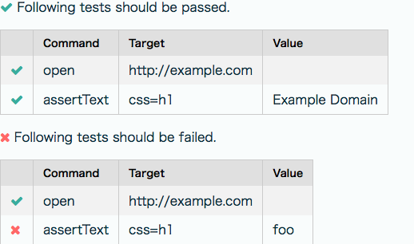
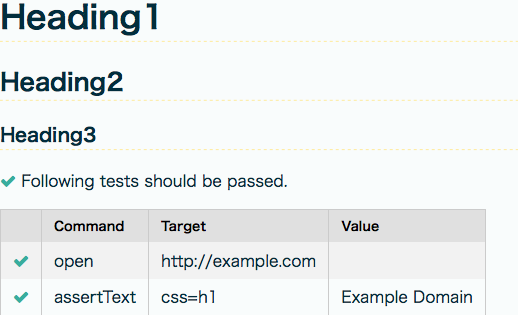

# Selenium IDE: Pretty Report

Pretty Report is a Selenium IDE plugin to save test case/test suite results as a pretty HTML report.

## Usage

 * Selenium IDE test case
<table>
<thead><tr><th>Command</th><th>Target</th><th>Value</th></tr></thead>
<tbody>
<tr>
    <td colspan="3" style="color: #DE0DD0;">Following tests should be passed.</td>
</tr>
<tr>
    <td>open</td>
    <td>http://example.com</td>
    <td></td>
</tr>
<tr>
    <td>assertText</td>
    <td>css=h1</td>
    <td>Example Domain</td>
</tr>
<tr>
    <td colspan="3" style="color: #DE0DD0;">Following tests should be failed.</td>
</tr>
<tr>
    <td>open</td>
    <td>http://example.com</td>
    <td></td>
</tr>
<tr>
    <td>assertText</td>
    <td>css=h1</td>
    <td>foo</td>
</tr>
</tbody>
</table>
 * Pretty Report

### Usage with headings

 * Selenium IDE test case
<table>
<thead><tr><th>Command</th><th>Target</th><th>Value</th></tr></thead>
<tbody>
<tr><td colspan="3" style="color: #DE0DD0;"># heading1</td></tr>
<tr><td colspan="3" style="color: #DE0DD0;">## heading2</td></tr>
<tr><td colspan="3" style="color: #DE0DD0;">### heading3</td></tr>
<tr><td colspan="3" style="color: #DE0DD0;">Following tests should be passed.</td></tr>
<tr><td>open</td><td>http://example.com</td><td></td></tr>
<tr><td>assertText</td><td>css=h1</td><td>Example Domain</td></tr>
</tbody>
</table>
 * Pretty Report

## Powered by

 - [Underscore.js](http://underscorejs.org/)
 - [Pure](http://purecss.io/)
 - [Font Awesome](http://fortawesome.github.io/Font-Awesome/)
 - [jQuery](http://jquery.com/)

## License

Copyright (C) 2013 Masashi Iizuka ([@uochan](http://twitter.com/uochan/))

Distributed under the MIT License.
